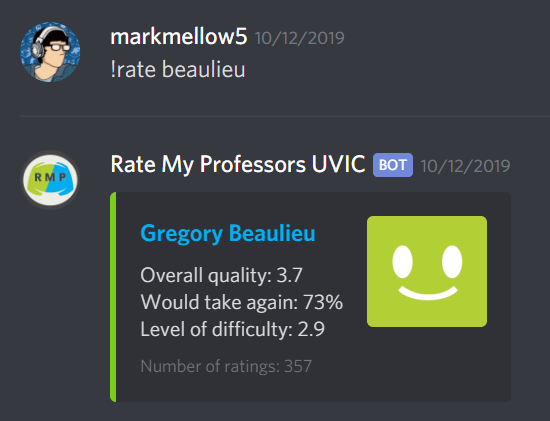

# Rate My Professors Web Scraping Discord Bot
A Discord bot that scrapes and sends information from ratemyprofessors.com to a Discord text channel.

## Using the Bot
The command syntax is as follows: 
```
!rate <PROFESSOR_LAST_NAME>
```

## Example


## Main Components
* [cheerio](https://cheerio.js.org/) - The jQuery based web scraper
* [discord.js](https://discord.js.org/) - Discord's API

## Note
*This project is no longer functional because ratemyprofessors.com changed their website.*
